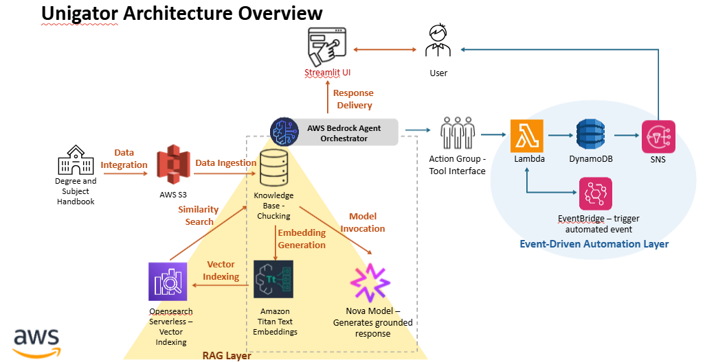

# Unigator

## ANZ Diversity Hackathon project

### Agentic AI powered academic intelligence at scale

Unigator is an end-to-end Agentic AI system built on AWS that helps university students select the right subjects based on career goals and automatically receive enrollment reminders.
The system combines Retrieval-Augmented Generation (RAG), agentic workflows, and serverless automation to deliver a personalized academic navigation experience.

### Key Features

1. Career-aligned subject recommendations
2. Intelligent retrieval from university handbook data (UTS, 2024)
3. Automated enrollment reminder system
4. Real-time conversational assistant

### Problem Statement

Students often struggle with:

- Understanding complex university handbook structures
- Mapping subjects to career paths
- Tracking enrollment deadlines

### Technologies

#### AI & Knowledge Retrieval

- Amazon Bedrock Agents
- Knowledge Base for RAG
- OpenSearch Serverless
- S3 Data Storage

#### Serverless Automation

- AWS Lambda
- DynamoDB
- Amazon SNS
- EventBridge Scheduler

### Solution Overview

Unigator provides an Agentic AI workflow powered by a Bedrock Navigator Agent that:

- Understands student career goals
- Retrieves degree and subject data from a Knowledge Base
- Maps subjects to required industry skills
- Suggests study resources
- Automatically schedules enrollment reminders

### Architecture Overview



High-Level Workflow:

User -> UI

- Bedrock Navigator Agent
- Knowledge Base (S3 + OpenSearch)
- Action Group (Lambda)
- DynamoDB + SNS + EventBridge

### Project Structure

unigator/
│── app.py
│── requirements.txt
│
├── lambda/
│ └── reminder_lambda.py
│
├── agent-config/
│ ├── navigator-agent-instructions.txt
│ └── action-group-schema.json
│
├── data-sample/
│ ├── degrees/
│ │ └── degree_sample.md
│ ├── subjects/
│ │ └── subject_sample.md
│
├── docs/
│ ├── architecture.png
│ └── usecase.docx

### Setup Instructions

1. Upload Documents to S3

Create an S3 bucket and upload subject handbook files.
Configuration:

- Region: us-east-1
- Block Public Access: Enabled
- Versioning: Enabled
- Encryption: SSE-S3

2. Create Bedrock Knowledge Base

Configuration:

- Data Source: S3
- Embedding Model: Titan Embeddings v2
- Vector Store: OpenSearch Serverless

_Sync documents and test retrieval using Bedrock console._

3. Create Bedrock Agent

Configure agent (instructions) to:

- Map career → subjects
- Retrieve academic documents
- Avoid hallucinations
- give proper formatting and not generate overly long response
  (agent-config/navigator-agent-instructions.txt)

Attach:

- Reminder action group (agent-config/reminder-action-group-schema.json)
- created Knowledge base

_Create alias, prepare the agent and test._

4. Lambda

Set environment variables:
For SNS -

- TABLE_NAME
- TOPIC_ARN
- ENROLLMENT_DEADLINE

Grant permissions:

- DynamoDB write access
- SNS publish access

Deploy the Lambda function code (lambda/reminder_lambda.py).

5. DynamoDB Table

Used to store reminder ID and reminder frequency so the system can track scheduled notifications.

- Partition Key: reminderId (String)

6. SNS Topic

Create a standard Topic
Subscribe to the Topic using Email protocol (or preferred protocol).

7. EventBridge

Create Scheduled rules (legacy)
Target -> created Lambda function

Runs once in 3 days to trigger reminder.
Cron expression -> 0 0 _/3 _ ? \*

8. Streamlit UI Setup

Install dependencies

```bash
pip install -r requirements.txt
```

Configure AWS SSO

Run App

```bash
streamlit run app.py
```

### Future Improvements

- Customised email frequency from the agent
- Calendar API integration
- Multi-university dataset ingestion

### References

UTS Handbook – Master of Data Science and Innovation
https://handbookpre2025.uts.edu.au/2024_1/courses/c04370.html

AWS Bedrock Agentic AI Starter Toolkit
